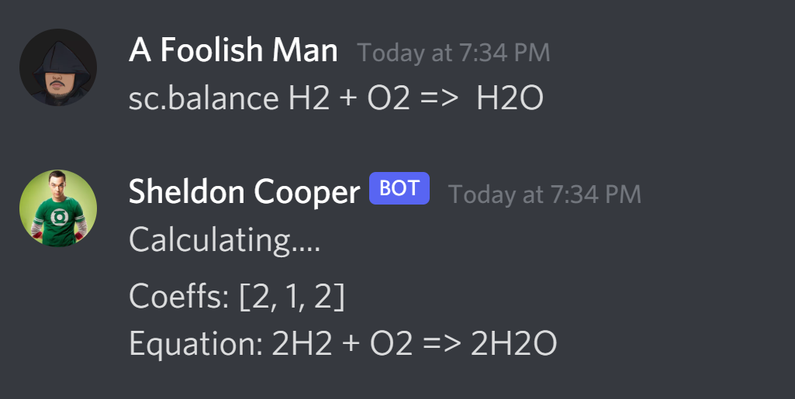
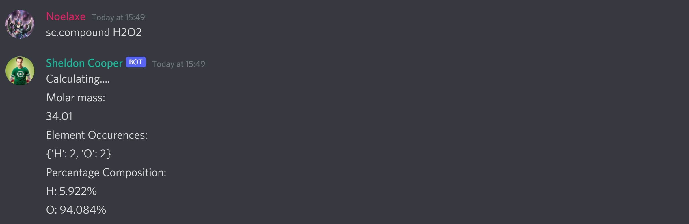
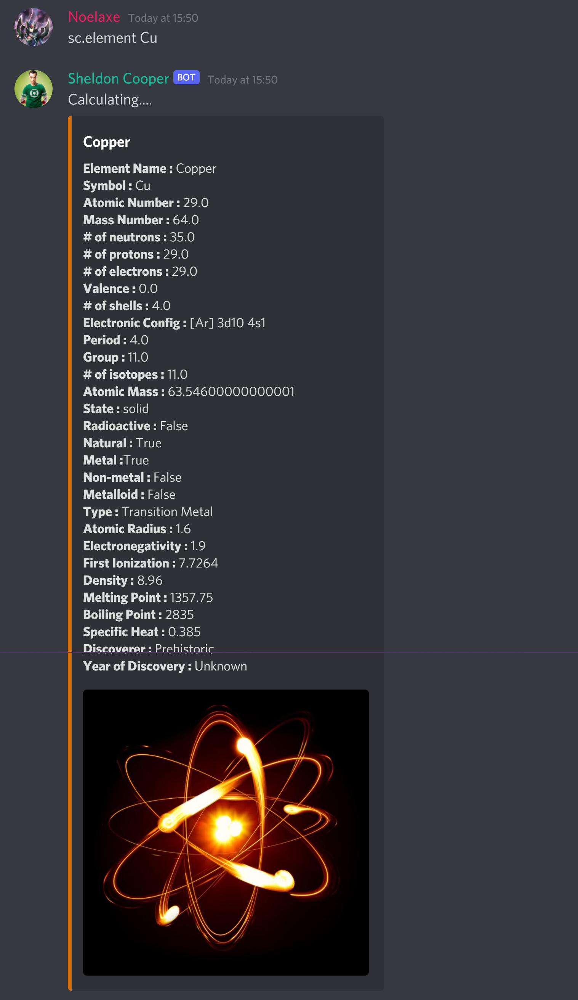

# Chemistry Cog
This cogs has 9 commands:
- [balance](#balance)
- [borbital](#borbital)
- [combustion](#combustion)
- [compound](#compound)
- [element](#element)
- [em](#em)
- [gal-cell](#gal-cell)
- [mole](#mole)
- [pubchem](#pubchem)


## balance
The balance command can be used to balance chemical reactions. Redox reactions and other complex reactiions cannot be balanced using this method. More features are being added to solve harder balancing problems

### Syntax
If you are using original prefix(sc.):
```
    sc.balance [<reactant> + <reactant> + ... => <product> + <product> + ....]
```
If you are using your custom prefix:
```
    {prefix}balance [<reactant> + <reactant> + ... => <product> + <product> + ....]
```

### Examples



## borbital
The borbital commands is used to return the energy of nth shell of a Bohr orbit which works for single electronic species like H, He+, Li2+ and so on.
The command takes an integer value which is the shell number(n)
The value returned is in Joules

### Syntax
If you are using original prefix(sc.):
```
    sc.borbital [n]
```
If you are using your custom prefix:
```
    {prefix}borbital [n]
```

### Examples


## combustion
It returns the chemical reaction of the hydrocarbon passed.
e.g. CH4, C2H6 and so on

### Syntax
If you are using original prefix(sc.):
```
    sc.combustion [hydrocarbon]
```
If you are using your custom prefix:
```
    {prefix}combustion [hydrocarbon]
```

### Examples


## compound
It returns the molar mass, atomic composition and the percentage composition of the compound
e.g. H2O2, MgCO3

### Syntax
If you are using original prefix(sc.):
```
    sc.compound [compound]
```
If you are using your custom prefix:
```
    {prefix}compound [compound]
```

### Examples



## element
It returns every single property of the element passed.
Remember that the symbol of the element has to be passes not the full name
e.g. H, C, O

### Syntax
If you are using original prefix(sc.):
```
    sc.element [element]
```
If you are using your custom prefix:
```
    {prefix}element [element]
```

### Examples
